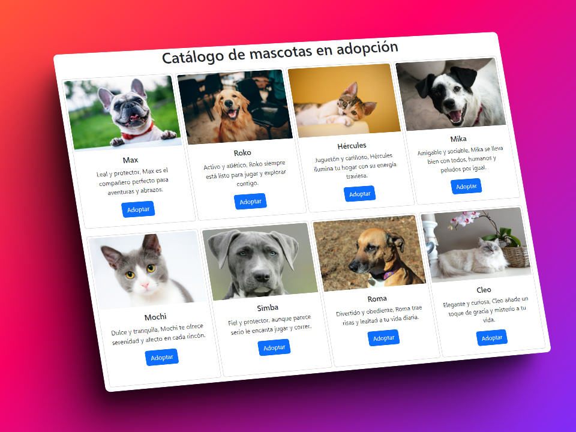

# Proyecto-Integrador-CaC-2023
Frontend del CRUD hecho con Python ([repo del backend](https://github.com/gabygramajo/backend-proyecto-integrador-CaC-2023))

  

Proyecto Integrador CaC 2023

Comisión: 23505 - Python FULL STACK.

Profesor: Alejandro Medici.

## Descripción
El Frontend consume una API REST creada con Python, Flask y MySQL el cual implementa el protocolo HTTP y los métodos GET, POST, PUT y DELETE.
Es un CRUD que consiste en administrar un catálogo de mascotas disponibles para adoptar, en el cual se podrá agregar, leer, actualizar y eliminar los registros de cada mascota en la Base de datos.
  
## Tecnologías
- HTML.
- CSS.
- Javascript.
- Vue js.
- Bootstrap.
